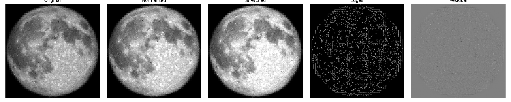

# Lunar Image Processing

A quality-inspection workflow for lunar surface imagery. For each image it produces a percentile-normalized version, a contrast stretch, a Canny edge map, a residual noise image, and a set of tiles, then records seventeen image-quality metrics to CSV so images in a batch can be compared numerically instead of by eye.



## Run

```bash
python3 -m pip install numpy matplotlib pillow scikit-image
python3 src/process_image.py
```

The script processes every `.png`, `.jpg`, `.jpeg`, `.tif`, and `.tiff` in `data/raw/` and writes to `outputs/`: full-size processed images in `images/`, tiles in `tiles/`, the histogram and comparison figures plus a text summary in `plots/`, and the metrics table at `image_metrics.csv`. A sample lunar mosaic print is included in `data/raw/` so the pipeline runs out of the box.

## Metrics

`image_metrics.csv` records one row per image: dimensions, min, max, mean, median, std, the 1st and 99th percentiles, `contrast_range` (p99 minus p1), `bright_frac` and `dark_frac` (fraction of pixels beyond the 95th and below the 5th percentile), `sharpness` (variance of the Laplacian of the normalized image), `edge_frac` (fraction of pixels the edge detector marks), `resid_std` (spread of the residual image), and `tiles_saved`. The metrics rank and compare images within a batch; they are not calibrated lunar surface measurements.

## Method notes

Normalization rescales between the 1st and 99th percentile rather than the absolute min and max, since a few extreme pixels can flatten the useful brightness range of the whole image. The contrast stretch does the same between the 5th and 95th percentiles for visual inspection of crater rims, shadow boundaries, and surface texture.

The residual image subtracts a Gaussian-blurred copy of the normalized image from itself, leaving small-scale variation as a rough noise check. Its display uses symmetric limits so positive and negative residuals read evenly.

Tiling keeps partial edge tiles when dimensions do not divide evenly, so the right and bottom of an image are never silently dropped. On scanned or mosaicked sources, some detected edges come from seams, compression artifacts, and brightness transitions rather than lunar surface features, which is worth remembering when reading `edge_frac`.
